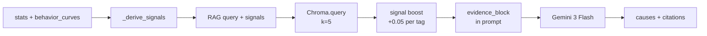
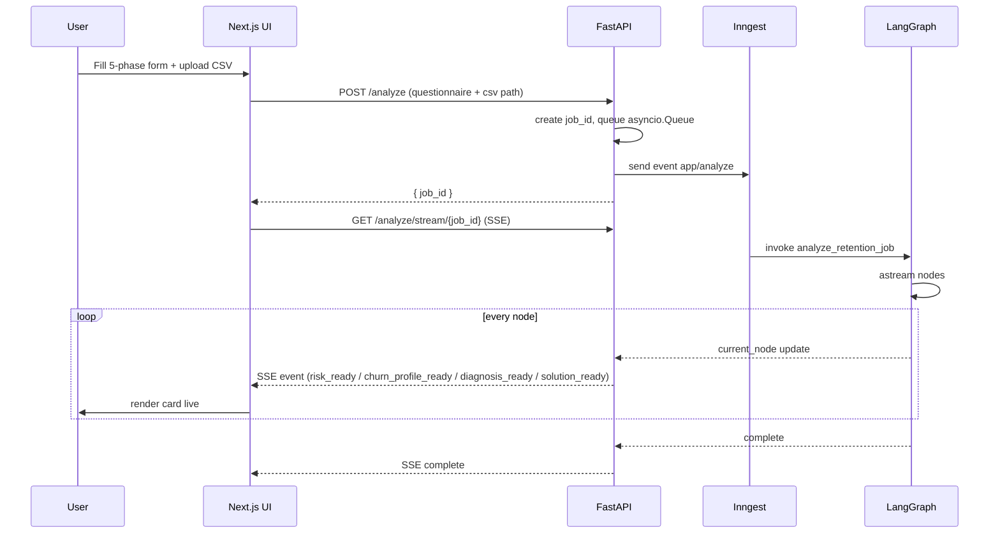

<div align="center">

# Retain AI

**A LangGraph pipeline that turns a customer CSV into a 30-60-90 retention playbook.**

CSV → Survival analysis → RAG-grounded diagnosis → Strategy agents → Simulated playbook — streamed live over SSE.

[Overview](#overview) · [Architecture](#architecture) · [Graph](#the-graph) · [RAG](#rag-layer) · [UI Flow](#ui--data-flow) · [Stack](#tech-stack) · [Setup](#setup)

</div>

---

## Overview

Retain AI ingests a customer CSV plus a qualitative questionnaire and produces a ranked, evidence-cited retention playbook. The backend is an 18-node LangGraph that fans out to parallel LLM agents for discovery and strategy, with a Chroma-backed RAG layer grounding root-cause diagnosis in curated retention frameworks. The frontend is a Next.js 16 App Router app that streams each stage's output as it completes via Server-Sent Events.

Three things the graph does that aren't visible in the final playbook:

- **Kaplan-Meier survival** on the raw tenure + churn columns (via `lifelines`) — powers the interactive churn probability slider on the results page.
- **CoxPH predictive risk model** — identifies which currently-active users have the shortest expected remaining lifetime.
- **Signal-boosted RAG retrieval** — the forensic agent derives signal tags from the stats (e.g. `30_day_cliff`, `low_integration`) and biases retrieval toward framework chunks tagged with those signals.

---

## Architecture

```mermaid
flowchart TD
    %% Premium minimalist styling
    classDef default fill:#09090b,stroke:#52525B,stroke-width:1px,color:#f8fafc,rx:6px,ry:6px;
    classDef ui fill:#09090b,stroke:#3b82f6,stroke-width:1px,color:#f8fafc,rx:6px,ry:6px;
    classDef ext fill:#09090b,stroke:#52525B,stroke-width:1px,color:#e4e4e7,stroke-dasharray: 4 4,rx:6px,ry:6px;
    classDef agent fill:#09090b,stroke:#8b5cf6,stroke-width:1px,color:#f3e8ff,rx:6px,ry:6px;
    classDef util fill:#09090b,stroke:#10b981,stroke-width:1px,color:#d1fae5,rx:6px,ry:6px;
    classDef gate fill:#09090b,stroke:#f59e0b,stroke-width:1px,color:#fef3c7,rx:6px,ry:6px;

    UI[Next.js UI<br/>form + results]:::ui -->|POST /analyze| API[FastAPI]:::ext
    API -.->|SSE stream live| UI
    API -->|Inngest event| JOB[analyze_retention_job]:::ext
    JOB --> II

    %% LangGraph Pipeline
    II[input_ingest]:::util --> DA{data_audit}:::gate

    %% Main branch
    DA -->|score ≥ 0.5| FE[feature_engineering]:::util

    %% Side branch
    DA -.->|score &lt; 0.5| RH[retry_handler]:::util
    RH -.-> FE

    FE --> BM[behavioral_map]:::util

    subgraph Discovery [Discovery Pod]
        FD[forensic_detective]:::agent
        PM[pattern_matcher]:::agent
    end
    style Discovery fill:none,stroke:#52525B,stroke-width:1px,stroke-dasharray:5 5,color:#A1A1AA

    BM --> FD & PM
    FD & PM --> DM[diagnosis_merge]:::gate

    DM --> HV{hypothesis_validation}:::gate
    HV -->|verified| CA[constraint_add]:::util

    CA --> HITL[adaptive_hitl]:::agent

    subgraph Strategy [Strategy Pod]
        UE[unit_economist]:::agent
        JTBD[jtbd_specialist]:::agent
        GH[growth_hacker]:::agent
    end
    style Strategy fill:none,stroke:#52525B,stroke-width:1px,stroke-dasharray:5 5,color:#A1A1AA

    HITL --> UE & JTBD & GH
    UE & JTBD & GH --> SM[strategy_merge]:::gate

    SM --> SIM[simulation]:::util
    SIM --> SC[strategy_critic]:::agent
    SC -->|approved| EA[execution_architect]:::agent
    EA --> END([END]):::util

    %% Loops (placed at end to keep DAG rank aligned)
    RH -.->|loop| II
    HV -.->|weak| BM
    SC -.->|low_lift/violation| HITL

    RAG[(Chroma<br/>vector DB)]:::ext
    FD -.->|RAG query| RAG

    %% Interactivity
    click II href "./docs/nodes/input-ingest.md" "Input Ingest Node"
    click DA href "./docs/nodes/data-audit.md" "Data Audit Node (Decision Gate)"
    click RH href "./docs/nodes/retry-handler.md" "Retry Handler Node"
    click FE href "./docs/nodes/feature-engineering.md" "Feature Engineering Node"
    click BM href "./docs/nodes/behavioral-map.md" "Behavioral Map Node"
    click FD href "./docs/nodes/forensic-detective.md" "Forensic Detective Agent"
    click PM href "./docs/nodes/pattern-matcher.md" "Pattern Matcher Agent"
    click DM href "./docs/nodes/diagnosis-merge.md" "Diagnosis Merge Node"
    click HV href "./docs/nodes/hypothesis-validation.md" "Hypothesis Validation Gate"
    click CA href "./docs/nodes/constraint-add.md" "Constraint Add Node"
    click HITL href "./docs/nodes/adaptive-hitl.md" "Adaptive HITL Agent"
    click UE href "./docs/nodes/unit-economist.md" "Unit Economist Agent"
    click JTBD href "./docs/nodes/jtbd-specialist.md" "JTBD Specialist Agent"
    click GH href "./docs/nodes/growth-hacker.md" "Growth Hacker Agent"
    click SM href "./docs/nodes/strategy-merge.md" "Strategy Merge Node"
    click SIM href "./docs/nodes/simulation.md" "Simulation Node"
    click SC href "./docs/nodes/strategy-critic.md" "Strategy Critic Agent"
    click EA href "./docs/nodes/execution-architect.md" "Execution Architect Agent"
    click RAG href "./docs/rag.md" "RAG Layer Overview"
```



Parallel fan-out is native LangGraph: `behavioral_map` emits edges to both discovery nodes; `adaptive_hitl` emits edges to all three strategy nodes. Merge nodes collect the outputs.

---

## The Graph

Entry: `input_ingest` · Exit: `execution_architect → END` · Compiled in [`backend/app/graph/builder.py`](./backend/app/graph/builder.py).

| #   | Node                                                           | Role                                | Tool / Model                |
| --- | -------------------------------------------------------------- | ----------------------------------- | --------------------------- |
| 1   | [input_ingest](./docs/nodes/input-ingest.md)                   | Load CSV, detect key columns        | DuckDB                      |
| 2   | [data_audit](./docs/nodes/data-audit.md)                       | Quality score (nulls, dupes, size)  | Pandas                      |
| —   | [retry_handler](./docs/nodes/retry-handler.md)                 | Loop back if score < 0.5            | —                           |
| 3   | [feature_engineering](./docs/nodes/feature-engineering.md)     | RFM, LTV, CoxPH risk model          | lifelines CoxPHFitter       |
| 4   | [behavioral_map](./docs/nodes/behavioral-map.md)               | KM survival curve + cohorts         | lifelines KaplanMeierFitter |
| 5a  | [forensic_detective](./docs/nodes/forensic-detective.md)       | Root-cause diagnosis (RAG-grounded) | Gemini 3 Flash + Chroma     |
| 5b  | [pattern_matcher](./docs/nodes/pattern-matcher.md)             | Segment + sequence discovery        | Gemini 3 Flash              |
| 5c  | [diagnosis_merge](./docs/nodes/diagnosis-merge.md)             | Run skeptic, merge hypotheses       | Gemini 3 Flash              |
| 6   | [hypothesis_validation](./docs/nodes/hypothesis-validation.md) | Confidence × robustness gate        | pure Python                 |
| 7   | [constraint_add](./docs/nodes/constraint-add.md)               | Budget/legal feasibility filter     | pure Python                 |
| 8   | [adaptive_hitl](./docs/nodes/adaptive-hitl.md)                 | Generate clarifying questions       | Gemini 3 Flash              |
| 9a  | [unit_economist](./docs/nodes/unit-economist.md)               | ROI/LTV-CAC strategies              | Groq Llama 3.3 70B          |
| 9b  | [jtbd_specialist](./docs/nodes/jtbd-specialist.md)             | Jobs-to-be-Done strategies          | Groq Llama 3.3 70B          |
| 9c  | [growth_hacker](./docs/nodes/growth-hacker.md)                 | AARRR tactics + experiments         | Groq Llama 3.3 70B          |
| 9d  | [strategy_merge](./docs/nodes/strategy-merge.md)               | Rank merged recommendations         | pure Python                 |
| 10  | [simulation](./docs/nodes/simulation.md)                       | Monte Carlo lift (10k runs)         | NumPy                       |
| 11  | [strategy_critic](./docs/nodes/strategy-critic.md)             | Senior-partner review               | Groq Llama 3.3 70B          |
| 12  | [execution_architect](./docs/nodes/execution-architect.md)     | Final 30-60-90 playbook             | Groq Llama 3.3 70B          |

Routing thresholds live in [`backend/app/graph/conditions.py`](./backend/app/graph/conditions.py). Retry/iteration loops are currently capped at 0 (one-shot); raise `MAX_RETRIES`, `MAX_DISCOVERY_ATTEMPTS`, or `MAX_CRITIC_ITERATIONS` to enable looping.

---

## RAG Layer

The forensic agent retrieves 5 relevant framework chunks before reasoning about root causes, and must cite the chunk IDs it used in its JSON output. Chunks are ranked by cosine similarity plus a signal-tag boost (e.g. if stats show a 30-day cliff, chunks tagged `30_day_cliff` get `+0.05` per matching tag). See [docs/rag.md](./docs/rag.md) for the corpus, ingestion, and retrieval logic.



---

## UI & Data Flow



Full detail in [docs/ui-flow.md](./docs/ui-flow.md).

---

## Tech Stack

| Layer     | Stack                                                                       |
| --------- | --------------------------------------------------------------------------- |
| Frontend  | Next.js 16.2.4 (App Router), React 19, Tailwind v4, shadcn/ui, lucide-react |
| Backend   | FastAPI, Inngest (background jobs), LangGraph, LangChain                    |
| LLMs      | Google Gemini 3 Flash (discovery), Groq Llama 3.3 70B (strategy & critique) |
| Data      | DuckDB (CSV parsing), Pandas, NumPy, lifelines (KM + CoxPH)                 |
| RAG       | ChromaDB (PersistentClient, `all-MiniLM-L6-v2`, cosine)                     |
| Transport | Server-Sent Events (SSE) for live results streaming                         |

---

## Setup

<details>
<summary><b>Local dev</b> — click to expand</summary>

```bash
# Backend
cd backend
python -m venv .venv && source .venv/bin/activate
pip install -r requirements.txt
python -m app.rag.ingest          # one-time: load retention corpus into Chroma
uvicorn app.main:app --reload     # http://localhost:8000

# Frontend
cd frontend
npm install
npm run dev                       # http://localhost:3000
```

Required env (`backend/.env`):

```
GOOGLE_API_KEY_1=...
GOOGLE_API_KEY_2=...
GROQ_API_KEY_1=...
GROQ_API_KEY_2=...
GROQ_API_KEY_3=...
INNGEST_DEV=1
```

Put sample CSVs in `backend/data/` — the form's file upload resolves relative paths against that directory.

</details>

---

<sub>Further reading: [State schema](./docs/state.md) · [Nodes](./docs/nodes/) · [Agents](./docs/agents/) · [RAG](./docs/rag.md) · [UI flow](./docs/ui-flow.md)</sub>
