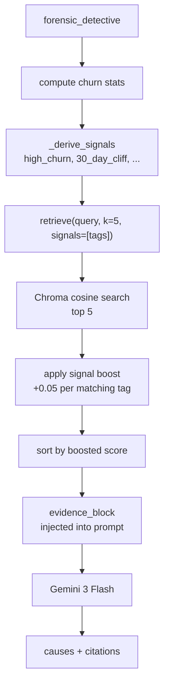

# RAG Layer

The RAG layer grounds the Forensic Detective's root-cause analysis in a curated corpus of B2B SaaS retention frameworks, with retrieval biased toward the data patterns the pipeline has already detected.

## Files

| File | Role |
|---|---|
| [`backend/app/rag/corpus_data.py`](../backend/app/rag/corpus_data.py) | The corpus — a Python list of `{id, text, metadata}` chunks |
| [`backend/app/rag/store.py`](../backend/app/rag/store.py) | Chroma client, collection, `retrieve()` with signal boost |
| [`backend/app/rag/ingest.py`](../backend/app/rag/ingest.py) | `python -m app.rag.ingest` — wipes and reloads the collection |

## Corpus

~36 curated chunks covering activation / aha moment, PMF, pricing, engagement decay, customer success, segmentation, integration, long-tenure, drop-off patterns, win-back, B2B-specific motions, diagnosis methodology, playbooks, benchmarks, PLG, and education.

Each chunk:

```python
{
    "id": "reforge_aha_001",
    "text": "...",
    "metadata": {
        "source": "Reforge — Aha Moment",
        "topic": "activation",
        "signals": "short_tenure_churn,30_day_cliff,onboarding_friction",
        "industry": "b2b_saas",
    },
}
```

`signals` is a comma-separated list of semantic tags that describe which data patterns this chunk is most relevant to.

## Vector store

```python
chromadb.PersistentClient(path="app/rag/chroma_db")
collection = client.get_or_create_collection(
    name="retention_knowledge",
    metadata={"hnsw:space": "cosine"},
)
```

- Embedder: Chroma's default `all-MiniLM-L6-v2` (no extra config needed).
- Persistence: on-disk at `backend/app/rag/chroma_db/` — survives restarts.
- Telemetry: `anonymized_telemetry=False`.

## Retrieval flow



## Scoring

```python
base_score  = 1.0 - (cosine_distance / 2.0)    # → similarity in [0, 1]
signal_boost = 0.05 * len(chunk.signals ∩ query.signals)
score       = base_score + signal_boost
```

Chunks are re-sorted by `score` (descending) after the boost is applied — so a chunk that's topically close **and** matches multiple signal tags reliably beats a purely-semantic match.

## Prompt injection

```python
evidence_block = "\n\n".join(
    f"[{i+1}] Source: {c['source']} (id: {c['id']})\n{c['text']}"
    for i, c in enumerate(retrieved)
)
```

The prompt then requires:

```
- Each root cause must be grounded in one or more retrieved frameworks.
- Reference the framework by its source id in the `citations` map.
```

Result: `forensic_detective_output.citations = {cause: [chunk_id, ...], ...}` — the UI can show which framework supports each diagnosed cause.

## Operations

First-time setup or after editing the corpus:

```bash
cd backend
python -m app.rag.ingest
```

This calls `reset_collection()` (drops + recreates) and then bulk-adds all chunks. Check with:

```python
col = get_collection()
col.count()   # should equal len(CORPUS)
```

If `col.count() == 0`, `retrieve()` returns an empty list and the forensic agent falls back to `"(no retrieved frameworks — reason from stats alone)"`.

## Extending

- **New chunks:** append to `CORPUS` with a unique `id`; re-run `python -m app.rag.ingest`.
- **New signal tags:** add them to chunk `metadata.signals` and teach `_derive_signals()` in `forensic_detective.py` to emit them for the matching stat patterns.
- **Different embedder:** pass an `embedding_function` to `get_or_create_collection(...)`.
- **Citations in other agents:** the pattern (query → retrieve → evidence_block → cited JSON) is portable; the strategy agents don't currently use RAG but `pattern_matcher` could benefit from it if diagnosis-quality regressions appear.
