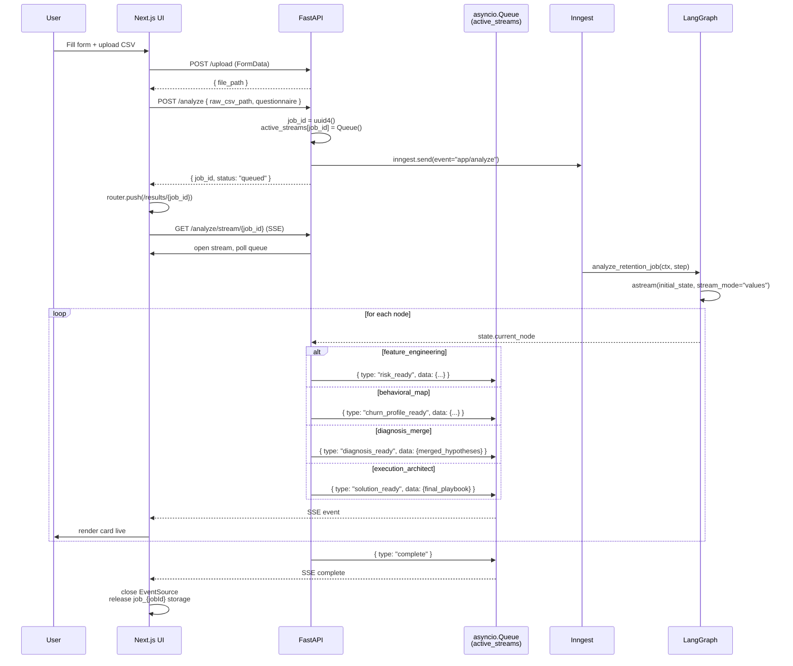

# UI & Data Flow

End-to-end trace from the form submission to the streamed playbook rendering.

## Files

| Role | File |
|---|---|
| Landing | [`frontend/app/page.tsx`](../frontend/app/page.tsx) |
| Form (5 phases, 45+ fields) | [`frontend/app/form/page.tsx`](../frontend/app/form/page.tsx) |
| Results + SSE | [`frontend/app/results/[job_id]/page.tsx`](../frontend/app/results/[job_id]/page.tsx) |
| API entry | [`backend/app/main.py`](../backend/app/main.py) |

## Routes

| Method | Path | Purpose |
|---|---|---|
| `POST` | `/upload` | Stores uploaded CSV in temp dir and returns unique `file_path`. |
| `POST` | `/analyze` | Queue a new analysis. Returns `{job_id}`. |
| `GET` | `/analyze/stream/{job_id}` | Server-Sent Events stream of per-node updates. |
| `GET` | `/` | Health check. |

## Request payload

The form collects 5 phases of qualitative questions (business context, ICP, monetization, channels, goals). When the user submits, the frontend first uploads the CSV via `POST /upload`, retrieves a temporary file path, and then sends the complete JSON payload:

```json
{
  "raw_csv_path": "a1b2c3d4e5f6.csv",
  "questionnaire": {
    "business_context": "...",
    "industry": "SaaS",
    "size": "100-500",
    "business_model": "B2B",
    "company_stage": "Series A",
    "time_range": "last_12_months",
    "legal_constraints": ["GDPR"],
    ...
  }
}
```

The API resolves the CSV path primarily against `/tmp/retain_ai_uploads/` for cloud deployments, falling back to `backend/data/` for local static files in `input_ingest_node`.

## Session storage

To survive page reloads without refetching, the frontend persists:

| Key | Contents |
|---|---|
| `latest_form_state` | current form inputs (so returning to `/form` pre-fills fields) |
| `latest_form_payload` | JSON actually sent to `/analyze` |
| `job_{jobId}` | accumulated SSE events + final playbook for one job |

## Sequence



## SSE event schema

Every event is JSON of the form:

```
{ "type": "<event_type>", "message": "...", "data": { ... } }
```

| `type` | Fired in (node) | `data` keys |
|---|---|---|
| `risk_ready` | `feature_engineering` | `high_risk_count, total_active, risk_pct, confidence, insight, has_model` |
| `churn_profile_ready` | `behavioral_map` | `churn_probability, survival_curve, max_tenure, median_survival_time, milestone_retention, behavior_cohorts` |
| `diagnosis_ready` | `diagnosis_merge` | `merged_hypotheses` |
| `solution_ready` | `execution_architect` | `final_playbook` |
| `complete` | stream teardown | `{}` |

## React consumption

The results page holds one `useRef<EventSource | null>` to prevent duplicate connections under React Strict Mode. Each event type updates a different piece of local state:

- `risk_ready` → "Churn Risk" card
- `churn_profile_ready` → Survival slider + milestone strip + median card
- `diagnosis_ready` → Root Cause cards
- `solution_ready` → Playbook tab (problems, 30-60-90, metrics, risks)

## Survival slider

The survival curve arrives as `{ "month_1": 0.95, "month_2": 0.91, ... }`. The page parses it once:

```ts
const points = parseSurvivalCurve(curves.survival_curve);
```

…initializes `tenureSlider` to `max_tenure`, and on each slide updates:

```ts
const churnPct = getChurnAtPeriod(points, tenureSlider);   // nearest-lower lookup
```

See `parseSurvivalCurve` and `getChurnAtPeriod` at the top of [`frontend/app/results/[job_id]/page.tsx`](../frontend/app/results/[job_id]/page.tsx).

## NaN-safe JSON

LangGraph state can contain `NaN` / `Infinity` from lifelines — invalid JSON. `_sanitize()` in [`backend/app/main.py`](../backend/app/main.py) walks the final state and replaces those with `None` before the Inngest response is serialized.

## Error handling

- **Backend error in a node:** the node writes `{errors: [...]}` into state but the graph continues; the SSE event for that node just isn't emitted.
- **Frontend reconnect:** if the SSE connection drops, re-opening `/analyze/stream/{job_id}` returns 404 once the job has completed (the queue is popped in the `finally` block of `event_generator`). The frontend falls back to the snapshot in `sessionStorage["job_{jobId}"]`.
- **Inngest signature changes:** the job handler uses the `*args, **kwargs` pattern to remain compatible across Inngest SDK 0.5.x versions — `ctx = kwargs.get('ctx') or args[0]`.
